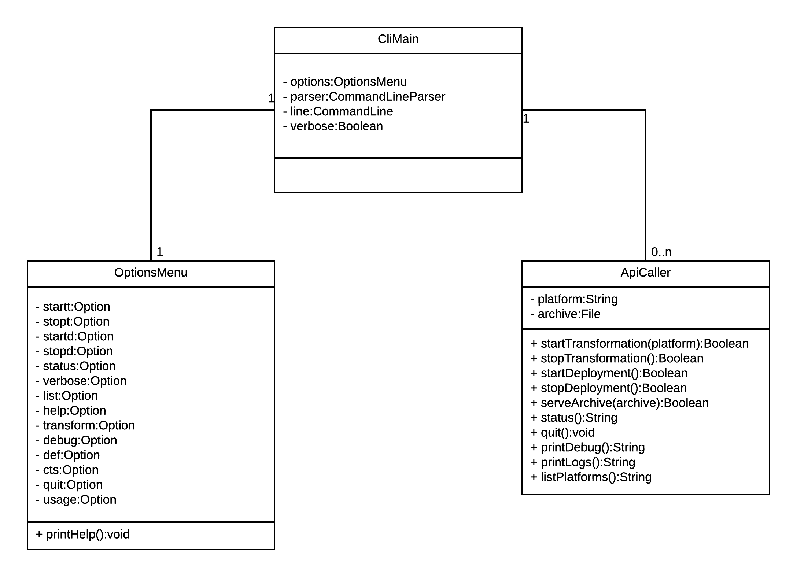

# Definition CLI Architecture
This document describes the architecture, the supported commands and used libraries for the CLI component of the TOSCAna Software.

## Class Diagram

***Note:*** This diagram was created using LucidChart. The source file can be found [here](https://www.lucidchart.com/invitations/accept/6c4ca4c7-d79a-4fee-82ba-6a79e2971f39).

## CliController

The CliController is the main class to initialize the CLI and show the possible commands of the OptionsMenu the User can execute. After the user has input a command, the CliController calls the ApiController to process the command.

## OptionsMenu
The OptionsMenu contains all commands the User can call with the CLI.

The methods shown in the above class diagram have the following functionality:
* `printHelp():Boolean` - prints all possible Commands the User can call
* `printUsage():Boolean` - the Usage of the specific CLI command is explained

## ApiController
The ApiController performs the tasks the User wants to do and calls the functions of the REST API.

The methods shown in the above class diagram have the following functionality:
* `startTransformation(platform: String): Application` - starts a new Transformation to the desired Platform
* `stopTransformation():Boolean` - stops currently running Transformation
* `serveArchive(archive: File):Boolean` - the Archive gets uploaded to the API Server
* `receiveArchive(output:File):Boolean` - the transformed archive gets downloaded from the API Server
* `printLogs():String` - prints logs for better debugging
* `listPlatforms():String` - lists all available Platforms where an archive can be deployed

## Basics
The main tasks of the CLI component are:
- parse and call the commands
- call the method to transform a given topology to a custom platform (start / stop / transform platform)
- show current status of transformation
- print detailed logs if wanted
- show supported platforms
- create threads to provide asynchronous operations

## Supported Commands
| command | description | option |
|-----------------------|-----------------------|-------------------------------|
| start transformation | starts the transformation | -s or --start-transformation |
| abort transformation | stops the transformation | -a or --abort-transformation |
| verbose | show logs while transformation | -v or --verbose |
| list | show all available supported platforms | -l or --list |
| transform | transform the given topology to the desired platforms | -t platform or --transform platform |
| help | prints the man page | -h or --help |
| output | location where the transformation should be placed | -o location or --output location
| usage | explains how the command works | -u command or -usage command |

## Architecture Library
To control the TOSCAna software we need a command-line-interface (CLI) which will be integrated in the program-code. Therefore we could use different libraries.

## Considered Alternatives

* library created by ourself
* open source library from apache - ["Commons CLI"](https://commons.apache.org/proper/commons-cli/index.html)
* [args4j](https://github.com/kohsuke/args4j)
* [JCommander](https://github.com/cbeust/jcommander)
* [jopt simple](http://pholser.github.io/jopt-simple/examples.html)
* [JewelCli](http://jewelcli.lexicalscope.com/)
* [Picocli](https://github.com/remkop/picocli)

## Conclusion

* *Chosen Alternative: Commons CLI from Apache*

### Commons CLI

* `+` open source
* `+` costumer prefers Commons CLI
* `+` well provided documentation
* `-` could be more powerful than needed

## License

Copyright (c) 2017 University of Stuttgart.

All rights reserved. Made available under the terms of the [Eclipse Public License v1.0] and the [Apache License v2.0] which both accompany this distribution.

 [Apache License v2.0]: http://www.apache.org/licenses/LICENSE-2.0.html
 [Eclipse Public License v1.0]: http://www.eclipse.org/legal/epl-v10.html