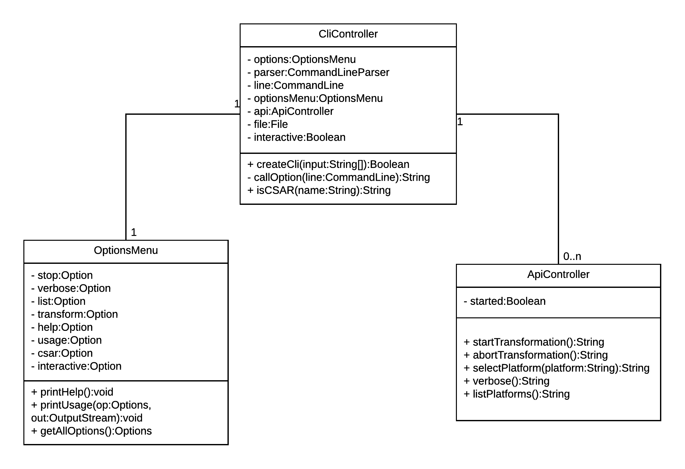

# Definition CLI Architecture
This document describes the architecture and the supported commands of the CLI component.

## Class Diagram

***Note:*** This diagram was created using LucidChart. The source file can be found [here](https://www.lucidchart.com/invitations/accept/6c4ca4c7-d79a-4fee-82ba-6a79e2971f39).

## CliMain
The CliMain is the main class to initialize the CLI and show the possible commands of the OptionsMenu the User can execute. After the user has input a command, the CliMain calls the ApiCaller to process the command.

## OptionsMenu

The methods shown in the above class diagram have the following functionality:
* `printHelp(): void` - prints all possible Commands the User can call

## ApiCaller

The methods shown in the above class diagram have the following functionality:
* `startTransformation(platform: String): Application` - starts a new Transformation to the desired Platform
* `stopTransformation():Boolean` - stops currently running Transformation
* `startDeployment():Boolean` - starts a new Deployment to the Destination
* `stopDeployment():Boolean` - stops currently running Deployment
* `serveArchive(archive: File):Boolean` - The Archive gets uploaded to the API Server
* `status():String` - print the Status of the currently running Transformation/ Deployment or other Operations
* `quit():void` - exits the CLI
* `printDebug():String` - enable debug mode for better Error handling
* `printLogs():String` - prints last created Logs
* `listPlatforms():String` - lists all available Platforms where an archive can be deployed

## Basics
The main tasks of the CLI component are:
- parse and call the commands
- call the method to transform and/ or deploy a given topology to a custom platform (start / stop / transform platform)
- show current status of transformation
- print detailed logs if wanted
- get status from different components
- show supported platforms
- create threads to provide asynchronous operations

## Supported Commands
| command | description | option |
|-----------------------|-----------------------|-------------------------------|
| start transformation | starts the transformation | -startt or --start-transformation |
| stop transformation | stops a transformation | -stopt or --stop-transformation |
| start deployment | starts a deployment | -startd or --start-deployment |
| stop deployment | stops the deployment | -stopd or --stop-deployment |
| status | prints some information about a current transformation or component | -status |
| verbose | show logs while transformation | -v or --verbose |
| list | show all available supported platforms | -l or --list |
| transform | transform the given topology to the desired platform | -t <platform> or --transform <platform> |
| help | prints the main page | -h or --help |
| debug | prints debug information | -debug |
| change | change a given value | -change <value> |
| default | prints the set default values | -default |
| quit | quits the CLI | -e or --quit |
